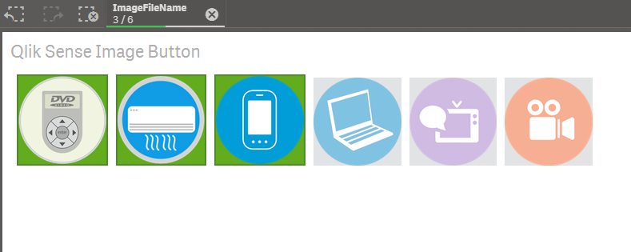

# Image Button for Qlik Sense

The **Image Button for Qlik Sense ** is a Qlik Sense extension to add image buttons to Qlik Sense.

## Sample 

## Usage
To use this extension:

1. Unzip the downloaded zip file into "C:\Users\%USERNAME%\Documents\Qlik\Sense\Extensions\" folder.

2. Place the image files to "C:\Users\%USERNAME%\Documents\Qlik\Sense\Content\Default\" folder.

3. Place this extension on a Qlik Sense sheet, and add a dimension which stores image file names (ex: image1.png, image2.png...).

## Licence
The software is provided "AS IS" without warranty of any kind. This project is licensed under the terms of the MIT license.

## Author
Masaki Hamano